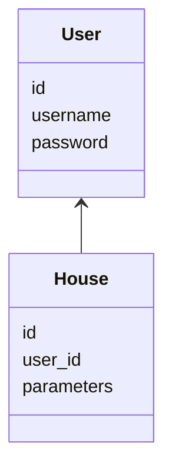

Packaging diagram:<br/>


Class diagram:<br/>

Sequence Diagram that describes the first time a user registers and interacts with an app. The first screen of an app offers only a log in option. The second, opened after `handle_registration` allows the user to register with username *John Oliver* and password *birb*.  <br/>
Next, an Assesment view is shown, which allows *John Oliver* to describe his house as built in *2002* and using type *2* heating. Next, `HouseService` asks for the id of the house of *John Oliver*, who himself is a user of id 43, but because there is no house references his id, HouseRepository returns *False*. Next, HouseRepository successfully creates a house for *John Oliver* and execution stack comes back to UI, which produces the House View with information and estimates of energy consumption and pollution.

```
sequenceDiagram
    actor User
    User->>UI: click on "Register" button
    UI->>UI : handle_registration
    User->>UI: click on "Register" button
    UI->> HouseService: register("John Oliver", "birb")
    HouseService->>UserRepostitory : register("John Oliver", "birb")
    UserRepostitory->>HouseService: user
    HouseService->>UI: user
    UI->>UI : handle_assessment_view
    User->>UI : click on "Update"
    UI->>HouseService : update_house(43, "2002,2")
    HouseService->>HouseRepository : get_users_house_id(43)
    HouseRepository->> HouseService: False
    HouseService->>HouseRepository : create_house(43, "2002,2")
    HouseRepository-->HouseService : 
    HouseService--> UI : 
    UI ->> UI : _handle_house(43)

```
This differs from the experience of a user who has registered before and has already provided information on his house, because that user will, after logging in, immediatelly get the House view (which is provided by the `_handle_house()` function).
