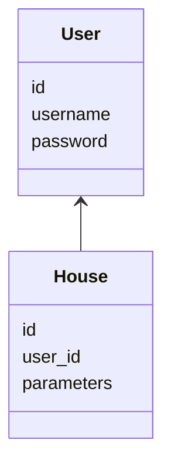

## Structure
<p align="center">
    
</p>

# Packaging diagrams<br/>


# Class diagrams<br/>

Sequence Diagram that describes the first time a user registers and interacts with an app. The first screen of an app offers only a log in option. The second, opened after `handle_registration` allows the user to register with username *John Oliver* and password *birb*.  <br/>
Next, an Assesment view is shown, which allows *John Oliver* to describe his house as built in *2002* and using type *2* heating. Next, `HouseService` asks for the id of the house of *John Oliver*, who himself is a user of id 43, but because there is no house references his id, HouseRepository returns *False*. Next, HouseRepository successfully creates a house for *John Oliver* and execution stack comes back to UI, which produces the House View with information and estimates of energy consumption and pollution.

```
sequenceDiagram
    actor User
    User->>UI: click on "Registration" button
    UI->>UI : handle_registration
    User->>UI: click on "Register" button
    UI->> HouseService: register("John Oliver", "birb")
    HouseService->>UserRepostitory : register("John Oliver", "birb")
    UserRepostitory->>HouseService: user
    HouseService->>UI: user
    UI->>UI : handle_assessment_view
    User->>UI : click on "Update"
    UI->>HouseService : update_house(43, "2002,2")
    HouseService->>HouseRepository : get_users_house_id(43)
    HouseRepository->> HouseService: False
    HouseService->>HouseRepository : create_house(43, "2002,2")
    HouseRepository-->HouseService : 
    HouseService--> UI : 
    UI ->> UI : _handle_house(43)

```
This differs from the experience of a user who has registered before and has already provided information on his house, because that user will, after logging in, immediatelly get the House view (which is provided by the `_handle_house()` function).<br>
The application uses Tkinter for graphical interface. There is a few files for the ui
# Overview of specific files
###### tasks.py
Contains commands for poetry, allowing e.g. `poetry run invoke start` to start the programme.
###### /ui
A directory containing classes shown to the user, among them:
###### administration_view.py
Handles the administration interface, allowing administrators to manage parameters related to house age and types of heating.
###### assessment_view.py
Manages the interface for users to fill out a basic assessment about their home, including details like house age and types of heating.
###### house_view.py 
Displays information about the user's house, including energy consumption and pollution estimates, along with options to update or create assessments.
###### registration_view.py
Handles the registration interface for new users, allowing them to register with a username and password.
###### /repositories
A directory for repositories, which handle logic specific to each part of the application:
###### house_repository.py
Contains the HouseRepository class, which is responsible for handling data related to houses in the database. It includes methods for creating, updating, and fetching house data, as well as (partly) finding pollution and energy consumption based on house parameters.
###### model_repository.py
Contains the ModelRepository class, which manages data and evaluation related to models used in the application. It includes methods for evaluating equations for houses,, checking the validity of equations, fetching model data from the database, and updating the model in the database.
###### user_repository.py
Contains the UserRepository class, which handles user data in the database. It includes methods for user login, registration, and checking if a username already exists in the database.
###### /entities
###### house.py
Contains the House class, which represents a house entity in the application. 
###### model.py 
Contains the Model class, representing a model entity used in the application
###### user.py
Contains User class, which represents a user entity in the application.

