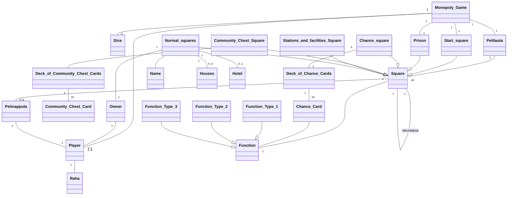

```mermaid
 classDiagram
      Monopoly_Game "1" -- "2" Dice
      Monopoly_Game "1" -- "2..8" Player 
      Monopoly_Game "1" -- "1" Pelilauta 
      Pelilauta "1" -- "40" Square 
      Square "1" -- "1" Square : seuraava
      Square "1" -- "0..8" Pelinappula
      Square "1" -- "1" Function
      Start_square --|> Square
      Prison --|> Square
      Chance_square --|> Square
      Chance_square "4" -- "1" Deck_of_Chance_Cards
      Community_Chest_Square --|> Square
      Community_Chest_Square -- Deck_of_Community_Chest_Cards
      Deck_of_Community_Chest_Cards "1" -- "16" Community_Chest_Card
      Deck_of_Chance_Cards "1" -- "16" Chance_Card
      Chance_Card -- Function
      Stations_and_facilities_Square  --|> Square
      Normal_squares  --|> Square
      Function_Type_1  --|> Function
      Function_Type_2  --|> Function
      Function_Type_3  --|> Function
      Normal_squares  -- Name
      Normal_squares "1"  -- "1" Owner 
      Normal_squares "1"  -- "0..4" Houses
      Normal_squares "1"  -- "0..1" Hotel
      Owner "1"  -- "0..1" Player
      Monopoly_Game "1" -- "1" Start_square
      Monopoly_Game "1" -- "1" Prison
      Pelinappula "1" -- "1" Player 
      Player "1" -- Raha
```
