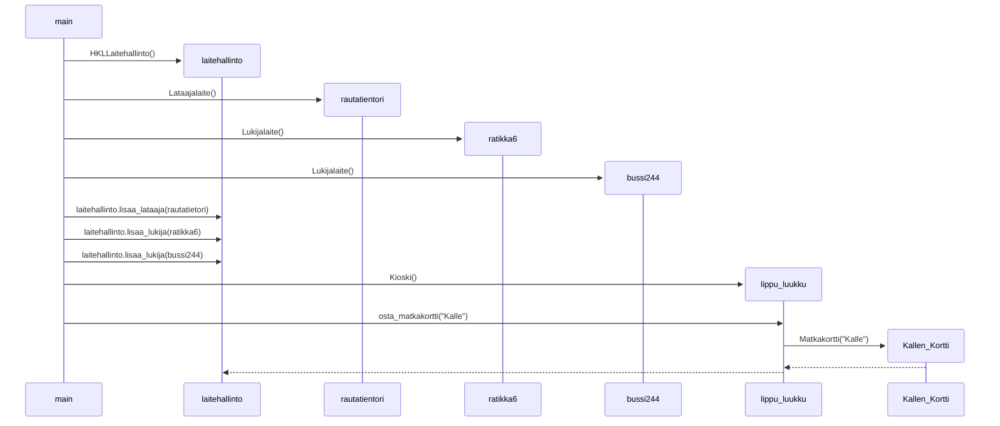

```mermaid
sequenceDiagram
    participant m as main
    create participant l as laitehallinto
    m ->> l: HKLLaitehallinto()
    create participant ri as rautatientori
    m ->> ri: Lataajalaite()
    create participant ra as ratikka6
    m ->> ra: Lukijalaite()
    create participant b as bussi244
    m ->> b: Lukijalaite()
    m ->> l: laitehallinto.lisaa_lataaja(rautatietori)
    m ->> l: laitehallinto.lisaa_lukija(ratikka6)
    m ->> l: laitehallinto.lisaa_lukija(bussi244)
    create participant lu as lippu_luukku
    m ->> lu : Kioski()
    m ->> lu : osta_matkakortti("Kalle")
    create participant ki as Kallen_Kortti
    lu ->> ki :  Matkakortti("Kalle")
    ki -->> lu : 
    lu -->> l : 
    %%participant l as laitehallinto
    %%participant J as John
    
    %%J->>A: Great!
    %%A->>J: Hello J, how are you?
    %%activate J
    %%J-->>A: Great!
    %%deactivate J
    %%A->>+J: Hello J, how are you?
    %%J-->>-A: Great!
```
